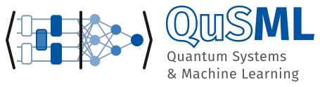

## The author

[{width=320px fig-alt="QuSML: Quantum Systems and Machine Learning"}](https://chaos.if.uj.edu.pl/marcinplodzien/)

### [Dr Marcin Płodzień](https://chaos.if.uj.edu.pl/marcinplodzien/)

I am an Assistant Professor at the Institute of Theoretical Physics, Jagiellonian University. I work at the intersection of many-body quantum systems, quantum information theory, and quantum technologies, with a focus on quantum metrology, quantum simulation, and quantum computation. My research interests also include using deep learning to study many-body quantum systems and using quantum simulators for machine learning tasks.

[www](https://chaos.if.uj.edu.pl/marcinplodzien/) · [Google Scholar](https://scholar.google.com/citations?user=eC9nCmgAAAAJ&hl=en) · [arXiv](https://arxiv.org/search/?searchtype=author&query=P%C5%82odzie%C5%84%2C+M) · [ORCID](https://orcid.org/0000-0002-0835-1644) · [ResearcherID](https://publons.com/researcher/K-7326-2017/) · [GitHub](https://github.com/MarcinPlodzien) · [LinkedIn](https://www.linkedin.com/in/marcin-plodzien/)

## The course

*Quantum Many-Body Simulation: from a single spin to quantum machine learning* is a set of hands-on lectures on simulating quantum systems in JAX, from scratch. It is written for students who have taken one semester of quantum mechanics and a first Python course, and for anyone who wants to learn how many-body quantum simulations are written in practice. Every derivation is carried out step by step and every result is checked numerically. The course is under active review: notebooks are being checked and improved, and their content may change.

## The engine

The simulation engine developed in the lectures is available as the Python package [SmoQ.jax](https://github.com/MarcinPlodzien/SmoQ.jax), a matrix-free JAX engine for quantum many-body systems. Its functions are explained one by one in [notebook 08b](ch03_matrix_free_engine/08b_building_quantum_simulator_engine.ipynb), and the full source is on the [engine page](engine.qmd).

## How to cite

> M. Płodzień, *Quantum Many-Body Simulation: from a single spin to quantum machine learning* (2026), https://marcinplodzien.github.io/quantum-many-body-simulation/

## License and feedback

Code and lecture material are released under the MIT License. Corrections and suggestions are welcome as [issues on GitHub](https://github.com/MarcinPlodzien/quantum-many-body-simulation/issues).
