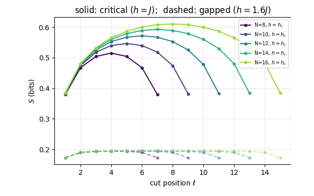

{width=60% fig-align=center fig-alt="Quantum phase transitions"}

A quantum phase transition occurs in the ground state as a parameter of the Hamiltonian is varied. The notebook uses
the transverse-field Ising chain, which has an exact solution, as a benchmark and locates its transition with four
independent signatures: the order parameter, the energy gap, the entanglement entropy with its central charge, and
the fidelity susceptibility. Finite-size scaling and data collapse turn results on finite chains into statements
about the thermodynamic limit, and further models illustrate other universality classes.

## Notebooks in this chapter

::: {.nb-item}
[Quantum phase transitions — mapping a phase diagram from finite chains](../ch13_quantum_phase_transitions/47_quantum_phase_transitions.ipynb)

How a ground-state phase transition is located numerically: the transverse-field Ising chain as a benchmark with an exact solution, four independent signatures of the same transition (order parameter, gap, entanglement entropy and central charge, fidelity susceptibility), finite-size scaling and data collapse, a second universality class from free fermions, and a Kosterlitz-Thouless transition that finite-size scaling cannot pin down.
:::

