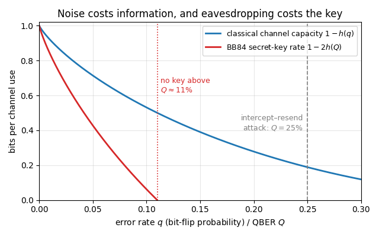

{width=60% fig-align=center fig-alt="Quantum communication and cryptography"}

Communication is the problem of making a distant party learn something. The sender, Alice, and the receiver, Bob, are
connected only by a physical channel such as a cable, an optical fibre or a radio link, and every real channel makes
errors. Cryptography adds a second requirement: the message must stay secret from an eavesdropper, Eve, who may listen
to the channel or even tamper with it. Every bank transfer, every encrypted message and every software update depends on
solving both problems at once. Today secrecy rests mostly on mathematical problems that are believed to be hard, above
all the factoring of large integers and the discrete logarithm, and a large quantum computer would solve both
efficiently (P. W. Shor, *SIAM J. Comput.* **26**, 1484 (1997), doi:10.1137/S0097539795293172). Quantum mechanics also
offers a remedy: a way to create a shared secret key whose security rests on the laws of physics and on clearly stated
assumptions about the devices, instead of on unproven assumptions about computing power.

The literature on communication tells its stories with a fixed cast. Alice and Bob are the trusted parties, who follow
the protocol, the complete public list of instructions saying who prepares, measures and sends what and when. Eve is the
adversary, and a security claim is meaningful only together with a statement of what she is allowed to do, the threat
model. On a classical channel she may listen without leaving a trace; on a quantum channel she cannot learn anything
without disturbing the signal in general, and this is the physics behind quantum key distribution. A third party,
Charlie, appears in some protocols as the source of entangled pairs or as a relay in the middle; whether Alice and Bob
must trust him is part of the threat model.

**Part I, the classical toolbox.** Quantum cryptography solves a classical problem, so the chapter starts with the
classical language in which its results are stated. [Notebook
50](../ch14_quantum_communication_and_cryptography/50_information_entropy_and_noisy_channels.ipynb) introduces Shannon's
entropy as the measure of information, conditional entropy and mutual information, channels and their capacity, and
error correction by parity checks, including the public parity-check search with which Alice and Bob remove the errors
from a shared key. [Notebook
51](../ch14_quantum_communication_and_cryptography/51_secrecy_one_time_pad_and_authentication.ipynb) treats secrecy:
the one-time pad, which is perfectly secure but needs a secret random key as long as the message, the key-distribution
problem that this creates, the idea of authentication (the public discussion between Alice and Bob must be protected
against forgery, which requires a short key shared in advance), and privacy amplification, which removes Eve's partial
knowledge of a shared key.

**Part II, the quantum part.** The second half asks what quantum mechanics changes. An unknown quantum state cannot be
copied, and gaining information about it disturbs it; entangled pairs give correlations that no classical mechanism
reproduces, yet carry no signal. [Notebook
52](../ch14_quantum_communication_and_cryptography/52_quantum_rules_channels_and_capacities.ipynb) derives and
simulates these rules, together with quantum channels and their capacities for classical and quantum information.
[Notebook 53](../ch14_quantum_communication_and_cryptography/53_quantum_key_distribution.ipynb) turns these rules
into protocols: quantum key distribution, prepare-and-measure (BB84) and entanglement-based, in which the error rate
that Alice and Bob measure bounds what Eve can know and fixes how long a secret key they can distil. Real
entanglement is noisy, and [notebook
54](../ch14_quantum_communication_and_cryptography/54_noisy_entanglement_distillation_repeaters_certification.ipynb)
treats noisy pairs as a resource: teleportation through them, twirling, the key rate when Eve holds the noise of the
pairs, distillation, quantum repeaters that carry
them over long distances, and how to certify them before use. Every protocol is run as a
simulation, round by round, with the eavesdropper and the noise included.

The quantum part builds on notebook 07 (density matrices and quantum channels) and on chapter 8, where the Bell states and the CHSH inequality (notebook 19), quantum
teleportation (notebook 20) and entanglement swapping and superdense coding (notebook 21) are derived and simulated.

## Notebooks in this chapter

::: {.nb-item}
[Information and noisy channels — Shannon entropy, mutual information, channel capacity and error correction](../ch14_quantum_communication_and_cryptography/50_information_entropy_and_noisy_channels.ipynb)

The classical theory that quantum communication builds on, with a simulation for every formula: surprise and Shannon entropy, the binary entropy function, compression of a biased coin with Huffman block codes, joint and conditional entropy and mutual information, channels as transition matrices (noiseless, binary symmetric, erasure and Z-channel), capacity as the maximum mutual information computed by a scan over input distributions, the noisy-channel coding theorem, the repetition and Hamming(7,4) codes, and the parity-check binary search that corrects errors by public discussion and leaks about h(Q) bits per key bit.
:::

::: {.nb-item}
[Secrecy — the one-time pad, the key-distribution problem, authentication and privacy amplification](../ch14_quantum_communication_and_cryptography/51_secrecy_one_time_pad_and_authentication.ipynb)

How a message is kept secret from an eavesdropper, with a simulation for every formula: the threat model and Kerckhoffs's principle, perfect secrecy as zero mutual information between message and ciphertext, the one-time pad and its proof, the two-time-pad attack on text, the leak of a biased key, Shannon's theorem that the key must be at least as long as the message, the key-distribution problem, computational against information-theoretic security, the man-in-the-middle attack and why quantum key distribution needs a short pre-shared authentication key, and privacy amplification by XOR and by random linear hashing.
:::

::: {.nb-item}
[What quantum mechanics changes — distinguishability, no-cloning, information versus disturbance, monogamy, quantum channels and their capacities](../ch14_quantum_communication_and_cryptography/52_quantum_rules_channels_and_capacities.ipynb)

The rules of quantum mechanics that matter for communication and secrecy, each derived and simulated with the engine: why nonorthogonal states cannot be told apart and the Helstrom bound, what no-cloning means for an eavesdropper, the theorem that information gain implies disturbance with a tunable probe attack on BB84 states, monogamy of entanglement checked on random extensions of a nearly perfect Bell pair, quantum channels (depolarising, dephasing, amplitude damping, erasure) on the Bloch ball, and the classical, quantum and entanglement-assisted capacities of these channels compared with Shannon's capacity.
:::

::: {.nb-item}
[Quantum key distribution — BB84 end to end, entanglement-based protocols and the secret-key rate](../ch14_quantum_communication_and_cryptography/53_quantum_key_distribution.ipynb)

The BB84 protocol simulated round by round with the engine, from random bases and measurements through sifting, error-rate estimation, parity-check error correction and random-hash privacy amplification to a final key that Alice and Bob share; the intercept-resend attack and its 25 % error rate; BBM92 with the source-replacement picture and Ekert's CHSH test; bit and phase errors, the Devetak-Winter rate and the uncertainty relation with quantum memory, which give the key rate 1 - 2h(Q) and its 11 % threshold, compared with the key extracted by the simulated protocol; device-independent key distribution and the practical attacks on real devices.
:::

::: {.nb-item}
[Noisy entanglement as a resource — Werner pairs, twirling, distillation, repeaters and certification](../ch14_quantum_communication_and_cryptography/54_noisy_entanglement_distillation_repeaters_certification.ipynb)

Noisy entangled pairs as the working resource of quantum communication, simulated with the engine: Werner pairs and the product rule for two noisy halves, teleportation through a Werner pair as a depolarising channel, twirling with the 24 Clifford gates, the purification held by Eve and her information about the key, the BBPSSW distillation step derived from the bilateral CNOT and run on density tensors and shot by shot, its iteration and cost, fibre loss and the repeaterless bound, a toy repeater chain of swapping and distillation, and the certification of delivered pairs from three local correlations with Hoeffding bounds, including an adversarial source and random sampling.
:::

