::: {.hero}
::: {.hero-text}
<h1 class="hero-title">From a Single Spin to Quantum Machine Learning</h1>

<p class="hero-tagline">Hands-on lectures on simulating quantum systems in JAX, from scratch</p>

<p class="hero-sub">Starting from an empty Python file, the lectures develop a matrix-free simulation engine and use it to study spin-1/2 systems, quantum circuits, unitary and dissipative dynamics, and quantum machine learning.</p>

<p class="hero-author"><a href="https://chaos.if.uj.edu.pl/marcinplodzien/"><b>Marcin Płodzień</b></a> · Institute of Theoretical Physics, Jagiellonian University in Kraków</p>

[Start with notebook 00a](ch01_computational_toolbox/00a_free_particle_gaussian_wave_packet.ipynb){.btn .btn-primary} [Browse the chapters](#chapters){.btn .btn-outline-primary} [The engine](ch03_matrix_free_engine/08b_building_quantum_simulator_engine.ipynb){.btn .btn-outline-primary}
:::

::: {.hero-image}
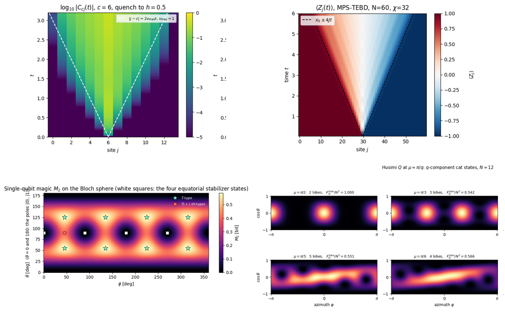{fig-alt="Light cone after a local quench, domain-wall melting computed with MPS-TEBD, the magic of single-qubit states, and Husimi functions of one-axis-twisted cat states"}
:::
:::

## Preface

Quantum many-body physics and quantum computing share one computational object: the state of many interacting two-level systems. Whether the two levels are the spin of an electron, two internal states of a trapped ion or the qubit of a superconducting processor, the state of $N$ of them is a vector of $2^N$ complex amplitudes, and every simulation is a sequence of operations on that vector. These lectures build, starting from an empty Python file, a complete simulation engine for such systems, **SmoQ.jax**, a matrix-free JAX engine for quantum many-body systems, and then use it to study their physics.

The simulator is written in [JAX](https://docs.jax.dev) and grows chapter by chapter. It stores the state of $N$ spins-1/2 as a rank-$N$ tensor and applies every operator, whether a gate, a Hamiltonian term, a Kraus operator or a projector, through a single `einsum` contraction, so the $2^N\times 2^N$ matrix of textbook treatments is never formed. Because the whole simulator is differentiable, the same code that evolves a spin chain also trains a quantum circuit, which makes it a natural laboratory for quantum machine learning. On this one primitive the notes construct a fully functional toolbox:

::: {.feature-grid}
::: {.feature}
**Spin-1/2 many-body physics**

Hamiltonians on arbitrary graphs, exact diagonalisation and matrix-free Lanczos, symmetries, entanglement, phase diagrams and quantum phase transitions.

Chapters: [2 · Quantum many-body spin systems with dense matrices](chapters/ch02_spin_systems_textbook_way.qmd) · [5 · Ground states and unitary dynamics](chapters/ch05_ground_states_and_unitary_dynamics.qmd) · [13 · Quantum phase transitions](chapters/ch13_quantum_phase_transitions.qmd)
:::
::: {.feature}
**Unitary dynamics**

Exact propagation, Runge–Kutta, Trotter–Suzuki, Chebyshev and Krylov integrators, compared on accuracy and cost, and applied to quantum quenches and light cones.

Chapters: [5 · Ground states and unitary dynamics](chapters/ch05_ground_states_and_unitary_dynamics.qmd)
:::
::: {.feature}
**Dissipative dynamics**

The Lindblad master equation on the density tensor and its unravelling into quantum trajectories, with noise channels and decoherence of entangled states.

Chapters: [6 · Open quantum systems](chapters/ch06_open_quantum_systems.qmd) · [3 · The matrix-free engine](chapters/ch03_matrix_free_engine.qmd)
:::
::: {.feature}
**Quantum circuits**

Gates as exponentials of Pauli operators, circuits as compiled lists of contractions, measurement, feed-forward, random circuits, and protocols such as teleportation.

Chapters: [4 · Digital quantum circuits](chapters/ch04_digital_quantum_circuits.qmd) · [8 · Quantum information protocols](chapters/ch08_quantum_information_protocols.qmd)
:::
::: {.feature}
**Quantum machine learning**

Parametrised circuits trained with gradients from the parameter-shift rule and from automatic differentiation, optimisers, the variational eigensolver, quantum autoencoders, training under shot noise and gate noise, and quantum reservoir computing, where many-body dynamics processes time series.

Chapters: [11 · Variational quantum circuits](chapters/ch11_variational_quantum_circuits.qmd) · [12 · Quantum reservoir computing](chapters/ch12_quantum_reservoir_computing.qmd)
:::
::: {.feature}
**Beyond the state vector**

Matrix product states with DMRG and TEBD for chains far longer than a state vector can hold, and diagnostics of entanglement, magic and metrological usefulness.

Chapters: [7 · Tensor networks](chapters/ch07_tensor_networks.qmd) · [9 · Entanglement and complexity diagnostics](chapters/ch09_entanglement_and_complexity.qmd) · [10 · Quantum metrology protocols](chapters/ch10_quantum_metrology_protocols.qmd)
:::
:::

On first contact, these methods are usually met as black boxes inside large libraries. Writing the simulator oneself shows what such a library takes care of: how the ordering of the qubits fixes every index, why a time step is stable or unstable, what an algorithm costs and where its error comes from. Every derivation in the notes is carried out explicitly, every algorithm is validated against an exact or independent result, and the code is written to be read, with documented functions and with the JAX tools introduced where they are first needed: compiled loops (`jit`, `lax.scan`), batching (`vmap`) and automatic differentiation (`grad`). The notes therefore teach three things together: the physics, the numerical methods, and the practice of writing scientific code that is both fast and correct.

## Quantum machine learning

The differentiable simulator is used throughout Chapters 11 and 12 to build and train quantum machine-learning models, each derived, implemented and tested against exact results:

- [Parametrised quantum circuits and four ways to compute their gradients](ch11_variational_quantum_circuits/40_parametrized_gates_and_gradients.ipynb) (notebook 40)
- [Optimisers for variational circuits, from gradient descent to the quantum natural gradient](ch11_variational_quantum_circuits/41_optimizers.ipynb) (notebook 41)
- [The variational quantum eigensolver for ground states of spin chains](ch11_variational_quantum_circuits/42_variational_quantum_eigensolver.ipynb) (notebook 42)
- [The measurement cost of a variational algorithm, with classical shadows in the training loop](ch11_variational_quantum_circuits/43_vqe_with_classical_shadows.ipynb) (notebook 43)
- [Training under gate noise: cost landscapes, noise-induced barren plateaus and error mitigation](ch11_variational_quantum_circuits/44_noisy_variational_circuits.ipynb) (notebook 44)
- [The quantum autoencoder, compressing quantum data with a variational circuit](ch11_variational_quantum_circuits/45_quantum_autoencoder.ipynb) (notebook 45)
- [Quantum reservoir computing, many-body dynamics as a machine for time-series prediction](ch12_quantum_reservoir_computing/46_quantum_reservoir_computing.ipynb) (notebook 46)

## Start here

The engine fits in one file, [`quantum_engine.py`](engine.qmd); notebook 08b, [Building the quantum simulator engine](ch03_matrix_free_engine/08b_building_quantum_simulator_engine.ipynb), explains every function in it with its mathematics and an independent check. Every capability above is a few lines of code on top of it. The snippet below prepares and samples a GHZ state, finds the ground state of a Heisenberg chain of sixteen spins, lets a Néel state melt under the same Hamiltonian, drives a decaying qubit with the Lindblad equation, and differentiates the energy of a variational circuit with respect to all its angles. It runs in about a minute or less on a laptop CPU (`python examples/starter.py`) and prints one labelled line per part; the notes explain every function it uses, starting from nothing.

```python
import jax, jax.numpy as jnp
from quantum_engine import *        # the simulator built in the notes

key = jax.random.PRNGKey(0)

# 1. Quantum circuit: a three-qubit GHZ state, sampled
psi = zero_state(3)                 # rank-3 tensor of shape (2, 2, 2)
psi = apply_gate(psi, H, (0,))
psi = apply_gate(psi, CNOT, (0, 1))
psi = apply_gate(psi, CNOT, (1, 2))
bits = sample_bitstrings(key, psi, shots=6)
print("GHZ samples:", bits.tolist())     # only 000 and 111

# 2. Many-body physics: Heisenberg chain of 16 spins, Lanczos
N = 16
H_xxx = heisenberg_terms(N)         # local terms, no 2^N x 2^N matrix
E0, gs = lanczos_ground_state(H_xxx, N)
S_half = entanglement_entropy(gs, list(range(N // 2)))
print(f"E0 = {E0:.6f},  half-chain entropy = {S_half:.4f} bits")

# 3. Unitary dynamics: a Neel state melts (2nd-order TEBD)
neel = product_state("01" * (N // 2))
psi_t, z0 = tebd_evolve(neel, H_xxx, dt=0.05, n_steps=40,
                        observe=lambda p: expect_local(p, Z, (0,)))
print("<Z_0>(t) every 10 steps:", [round(float(z), 3) for z in z0[::10]])

# 4. Dissipative dynamics: driven, decaying qubit (Lindblad)
rho = to_dm(zero_state(1))
drive = [((0,), 0.5 * X)]
decay = [((0,), SM, 0.2)]           # jump operator sigma^-, rate 0.2
for _ in range(200):
    rho = lindblad_rk4_step(rho, drive, decay, dt=0.05)
print(f"excited population at t = 10: {dm_matrix(rho)[1, 1].real:.4f}")

# 5. Variational circuit: energy gradient by autodiff
n, layers = 4, 2
H4 = heisenberg_terms(n)
cost = lambda th: energy(H4, hardware_efficient_ansatz(th, n, layers))
theta = 0.1 * jax.random.normal(key, (hea_num_params(n, layers),))
g = jax.grad(cost)(theta)
print(f"energy = {cost(theta):.4f}, gradient has {g.size} components")
```

**Where to go next.**

- *First contact with numerics:* notebooks 00a, 00b, 49, 01 and 02 ([Chapter 1](chapters/ch01_computational_toolbox.qmd)), then [Chapter 2](chapters/ch02_spin_systems_textbook_way.qmd).
- *Comfortable with quantum mechanics and Python:* start at [Chapter 3](chapters/ch03_matrix_free_engine.qmd), where the engine is built, and continue in order.
- *Interested in quantum information:* after Chapter 3, go to [Chapter 4](chapters/ch04_digital_quantum_circuits.qmd) and [Chapter 8](chapters/ch08_quantum_information_protocols.qmd).
- *Interested in quantum technologies:* [Chapter 10](chapters/ch10_quantum_metrology_protocols.qmd) on metrology and [Chapter 11](chapters/ch11_variational_quantum_circuits.qmd) on variational circuits build on Chapters 3–5.
- *Interested in quantum machine learning:* after Chapters 3–5, [Chapter 11](chapters/ch11_variational_quantum_circuits.qmd) (variational circuits, the variational eigensolver, quantum autoencoders) and [Chapter 12](chapters/ch12_quantum_reservoir_computing.qmd) (quantum reservoir computing).

## Chapters {#chapters}

13 chapters, each a short overview page followed by runnable notebooks (55 in total). The notebooks are numbered globally; each one carries the engine functions it uses in a folded *Engine recap* cell and ends with exercises, so any notebook also runs and can be studied on its own.

::: {.chapter-grid}
::: {.chapter-card}
[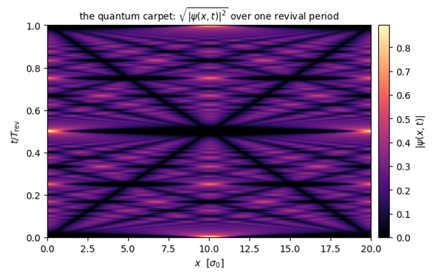{fig-alt="Computational toolbox"}](chapters/ch01_computational_toolbox.qmd)

[1 · Computational toolbox](chapters/ch01_computational_toolbox.qmd)

Simulate a single quantum particle on a grid and write fast, batched, differentiable array code.

<span class="nbcount">7 notebooks</span>
:::
::: {.chapter-card}
[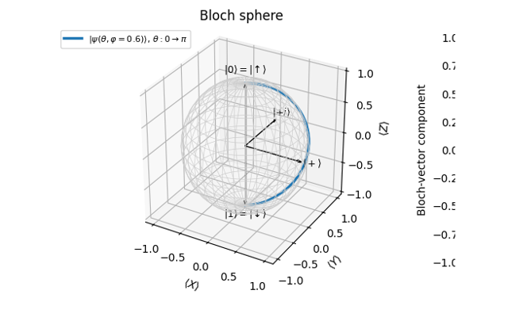{fig-alt="Quantum many-body spin systems with dense matrices"}](chapters/ch02_spin_systems_textbook_way.qmd)

[2 · Quantum many-body spin systems with dense matrices](chapters/ch02_spin_systems_textbook_way.qmd)

Build spin-chain Hamiltonians as dense matrices, diagonalise them and evolve states in time.

<span class="nbcount">2 notebooks</span>
:::
::: {.chapter-card}
[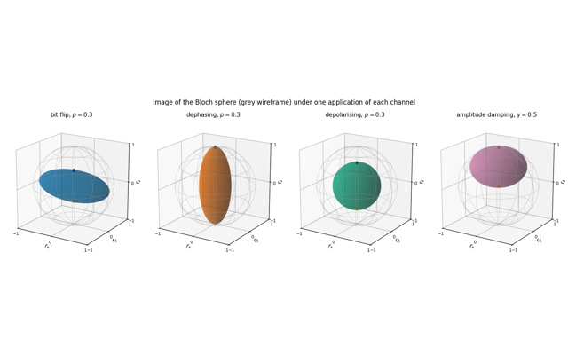{fig-alt="The matrix-free engine"}](chapters/ch03_matrix_free_engine.qmd)

[3 · The matrix-free engine](chapters/ch03_matrix_free_engine.qmd)

Act on a many-body state with einsum, and compute observables, entanglement, channels and measurements.

<span class="nbcount">5 notebooks</span>
:::
::: {.chapter-card}
[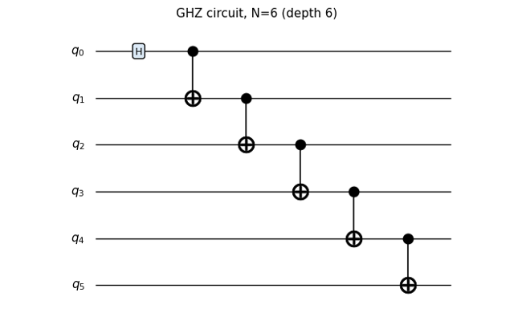{fig-alt="Digital quantum circuits"}](chapters/ch04_digital_quantum_circuits.qmd)

[4 · Digital quantum circuits](chapters/ch04_digital_quantum_circuits.qmd)

Write quantum circuits as lists of einsum contractions and sample random unitaries and circuits.

<span class="nbcount">2 notebooks</span>
:::
::: {.chapter-card}
[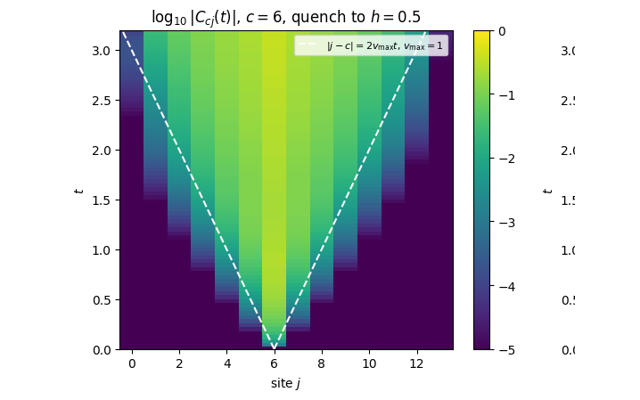{fig-alt="Ground states and unitary dynamics"}](chapters/ch05_ground_states_and_unitary_dynamics.qmd)

[5 · Ground states and unitary dynamics](chapters/ch05_ground_states_and_unitary_dynamics.qmd)

Find ground states with Lanczos and propagate states with Trotter, Chebyshev and Krylov methods.

<span class="nbcount">5 notebooks</span>
:::
::: {.chapter-card}
[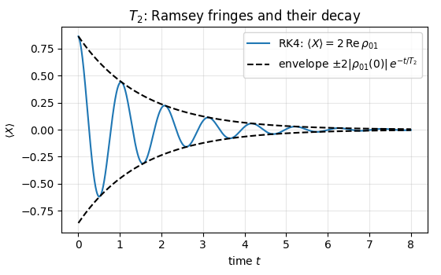{fig-alt="Open quantum systems"}](chapters/ch06_open_quantum_systems.qmd)

[6 · Open quantum systems](chapters/ch06_open_quantum_systems.qmd)

Simulate open quantum systems with the Lindblad equation and with quantum trajectories.

<span class="nbcount">2 notebooks</span>
:::
::: {.chapter-card}
[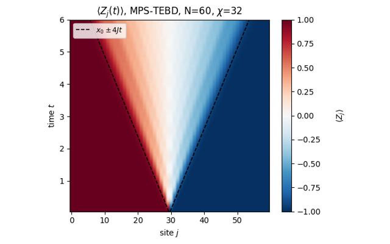{fig-alt="Tensor networks"}](chapters/ch07_tensor_networks.qmd)

[7 · Tensor networks](chapters/ch07_tensor_networks.qmd)

Represent one-dimensional states as matrix product states and run DMRG and TEBD on them.

<span class="nbcount">1 notebook</span>
:::
::: {.chapter-card}
[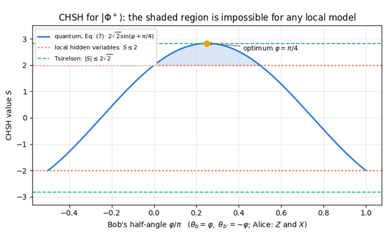{fig-alt="Quantum information protocols"}](chapters/ch08_quantum_information_protocols.qmd)

[8 · Quantum information protocols](chapters/ch08_quantum_information_protocols.qmd)

Simulate the standard quantum-information protocols end to end, with sampling and noise.

<span class="nbcount">6 notebooks</span>
:::
::: {.chapter-card}
[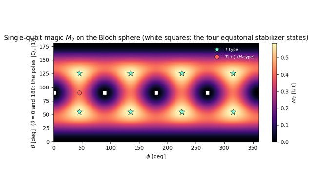{fig-alt="Entanglement and complexity diagnostics"}](chapters/ch09_entanglement_and_complexity.qmd)

[9 · Entanglement and complexity diagnostics](chapters/ch09_entanglement_and_complexity.qmd)

Quantify mixed-state entanglement, multipartite correlations, magic and circuit complexity.

<span class="nbcount">5 notebooks</span>
:::
::: {.chapter-card}
[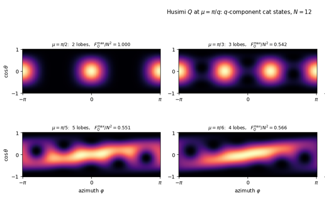{fig-alt="Quantum metrology protocols"}](chapters/ch10_quantum_metrology_protocols.qmd)

[10 · Quantum metrology protocols](chapters/ch10_quantum_metrology_protocols.qmd)

Compute quantum Fisher information and simulate metrology protocols from preparation to estimation.

<span class="nbcount">11 notebooks</span>
:::
::: {.chapter-card}
[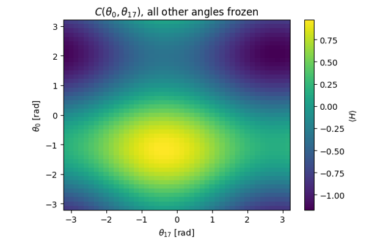{fig-alt="Variational quantum circuits"}](chapters/ch11_variational_quantum_circuits.qmd)

[11 · Variational quantum circuits](chapters/ch11_variational_quantum_circuits.qmd)

Train parametrised quantum circuits: gradients, optimisers, VQE, measurement cost and noise.

<span class="nbcount">7 notebooks</span>
:::
::: {.chapter-card}
[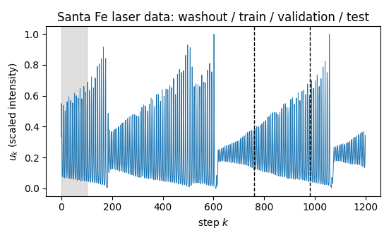{fig-alt="Quantum reservoir computing"}](chapters/ch12_quantum_reservoir_computing.qmd)

[12 · Quantum reservoir computing](chapters/ch12_quantum_reservoir_computing.qmd)

Use driven many-body dynamics as a trainable machine for time-series prediction.

<span class="nbcount">1 notebook</span>
:::
::: {.chapter-card}
[{fig-alt="Quantum phase transitions"}](chapters/ch13_quantum_phase_transitions.qmd)

[13 · Quantum phase transitions](chapters/ch13_quantum_phase_transitions.qmd)

Locate a quantum phase transition numerically from finite chains and finite-size scaling.

<span class="nbcount">1 notebook</span>
:::
:::

## Getting started

```bash
pip install -r requirements.txt          # jax, numpy, scipy, matplotlib, jupyter
python examples/starter.py               # the snippet above
jupyter lab                              # open any notebook in the ch*/ folders
```

The configuration cell at the top of every notebook selects the device (CPU or GPU) and the precision (single or double). Everything runs on a laptop CPU.

## Who this is for

Students who have taken one semester of quantum mechanics and a first Python course, and anyone who wants to learn how many-body quantum simulations are written in practice. Every derivation is carried out step by step, and every result is checked numerically.

## How to cite

> M. Płodzień, *Quantum Many-Body Simulation: from a single spin to quantum machine learning*, hands-on lectures in JAX with the SmoQ.jax engine (2026), https://marcinplodzien.github.io/quantum-many-body-simulation/
